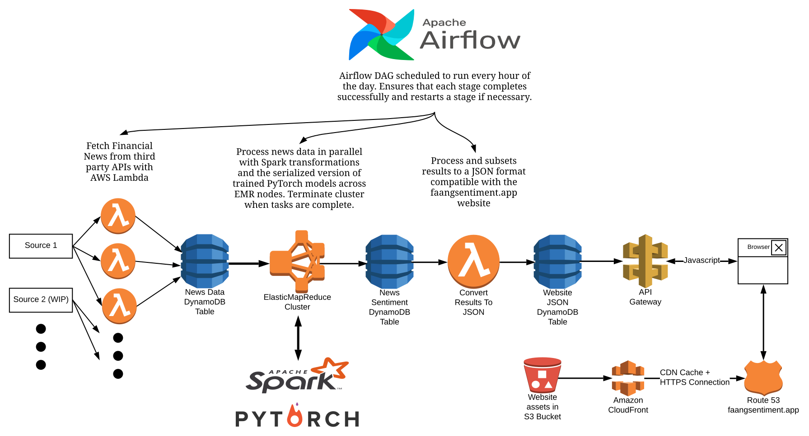

# FAANGSentiment.app

Live FAANG Stock Sentiment Tracker

Link to website: https://faangsentiment.app

## Backend Infrastructure Design

The application is built around several AWS services and can be divided up into the following groups:

* Computation: Lambda, Elastic Compute Cloud (EC2), Elastic Map Reduce (EMR)
* Data Storage: Simple Storage Service (S3), DynamoDB
* Website Serving: Route 53, CloudFront, Certificate Manager

Currently, the application is scheduled to collect and process data at an hourly rate in order to minimize cost, however, the application is designed to be capable of easily scaling beyond just the five stocks above (FAANG stocks) thanks to the integration of AWS Lambda, EMR, and DynamoDB in the processing pipeline.

Because of the serverless nature of AWS Lambda plus the high performance and scalability of DynamoDB, we can easily fetch news data for more stocks by simply providing a bigger list of stock tickers of interest.

By utilizing Apache Spark and provisioning more instances in the EMR Cluster or turning on the auto-scaling feature, we can easily scale the sentiment analysis component.

The website is also capable of handling millions of requests effortlessly and at a very cost efficient manner through the combination of hosting on S3, taking advantage of a CloudFront cache, and the relatively cheap cost of running an Amazon API Gateway that calls a simple Lambda function.

